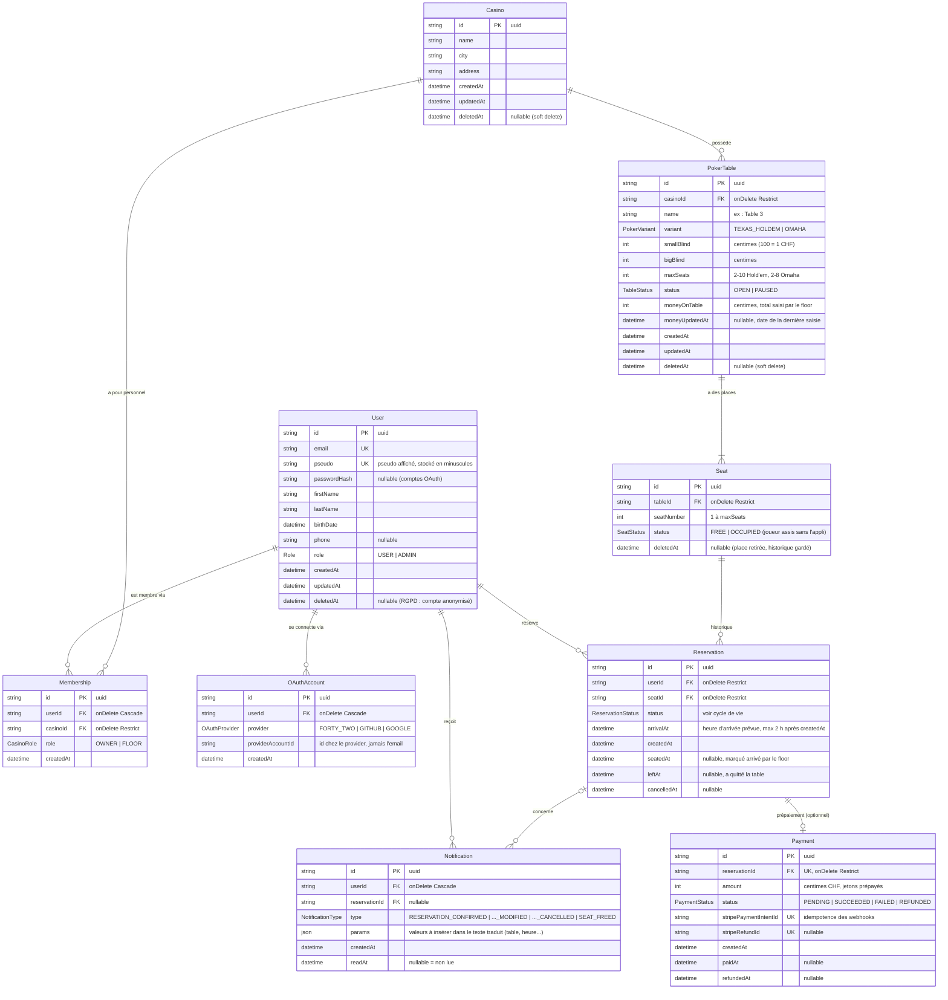
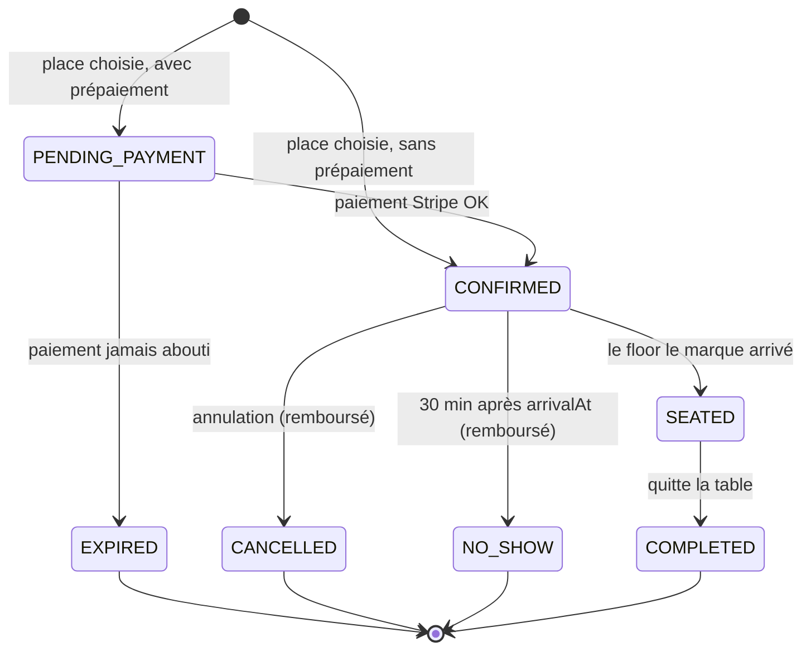

# Schéma de la base de données

Source de vérité : `backend/prisma/schema.prisma`. Ce diagramme doit rester synchronisé avec lui.

Légende des relations :
`||--o{` = un à plusieurs (0 ou plus) · `||--||` = un à un · `PK` = clé primaire · `FK` = clé étrangère · `UK` = unique

## Cycle de vie d'une réservation

**Réservation active** = `PENDING_PAYMENT`, `CONFIRMED` ou `SEATED` : elle occupe la place.
Les autres statuts sont terminaux et libèrent la place.

## Contraintes

| Modèle | Contrainte | Pourquoi |
|---|---|---|
| User | `email` unique | un compte par adresse |
| User | `pseudo` unique, stocké en minuscules + validation NestJS (3-20 caractères, `a-z 0-9 _`) | pas deux joueurs « Alice » et « alice » |
| Membership | `@@unique([userId, casinoId])` | un user ne peut être membre qu'une fois du même casino |
| Membership | `@@index([casinoId])` | « tous les membres du casino X » |
| OAuthAccount | `@@unique([provider, providerAccountId])` | un même id ne peut pas apparaître deux fois chez le même provider |
| OAuthAccount | `@@index([userId])` | « tous les comptes liés d'Alice » |
| PokerTable | `@@index([casinoId])` | « toutes les tables du casino X » |
| PokerTable | `CHECK` SQL (ajouté à la main dans la migration) + validation NestJS | `maxSeats` entre 2 et 10, max 8 en Omaha ; blinds > 0 et `bigBlind >= smallBlind` |
| Seat | `@@unique([tableId, seatNumber])` | un même numéro de place ne peut pas apparaître deux fois sur la même table |
| Reservation | **index unique partiel** `UNIQUE ("seatId") WHERE status IN ('PENDING_PAYMENT','CONFIRMED','SEATED')`, ajouté à la main dans la migration | une seule réservation active par place : anti double réservation exigé par le sujet. À vérifier (issue 12) : que `migrate dev` ne le supprime pas |
| Reservation | `@@index([userId])` | « mes réservations » |
| Reservation | `@@index([seatId])` | historique d'une place |
| Reservation | validation NestJS | `arrivalAt` entre maintenant et maintenant + 2 h |
| Payment | `reservationId` unique | au plus un paiement par réservation (remboursement = même ligne, statut `REFUNDED`) |
| Payment | `stripePaymentIntentId` unique, `stripeRefundId` unique | un webhook Stripe reçu deux fois n'est traité qu'une fois |
| Notification | `@@index([userId, readAt])` | « mes notifications non lues » (badge) |

## Règles métier liées au schéma

- **Création d'une table** : ses `Seat` (1 à `maxSeats`) sont créés dans la même transaction.
- **`maxSeats` diminue** : les places en trop reçoivent un `deletedAt` (jamais de `DELETE`, elles ont un historique de réservations).
  Les réservations actives dessus sont déplacées vers des places libres par le code, et le joueur est notifié.
- **`maxSeats` réaugmente** : on restaure les places soft-deletées (`deletedAt = null`) au lieu d'en créer de nouvelles,
  sinon le `@@unique([tableId, seatNumber])` bloque.
- **Pseudo** : obligatoire. À l'inscription OAuth, pré-rempli avec le login 42 / GitHub (modifiable),
  avec un suffixe (`alice_2`) s'il est déjà pris. C'est lui qui s'affiche aux autres joueurs, jamais le nom réel.
- **Place libre pour un joueur** = `Seat.status = FREE`, pas de `deletedAt`, et aucune réservation active dessus.
- **Réservation** : on réserve une place libre **maintenant**, pour une arrivée dans les 2 h. Pas de créneaux à l'avance
  (un joueur de poker peut rester 20 min comme 6 h, on ne peut pas prévoir quand la place se libère).
- **Pas de valeurs dérivées stockées** : total des jetons, nombre de réservations, temps à table (`leftAt - seatedAt`)
  se calculent pour le tableau de bord.

## Conventions

- **Argent** : toujours un `Int` en centimes de **CHF** (seule devise, pas d'autre pays prévu), jamais `Float` ni `Decimal` (format natif de Stripe).
- **Données financières** : un `Payment` n'est jamais supprimé (conservation 10 ans, Code des obligations art. 958f).
  Un compte supprimé (RGPD) est **anonymisé** : email et pseudo remplacés par `deleted-<id>`, nom, prénom, téléphone effacés, `deletedAt` renseigné.
  Ses `OAuthAccount`, `Membership` et `Notification` sont supprimés par le code dans la même transaction
  (le `Cascade` ne se déclenche pas, puisque le User n'est jamais supprimé physiquement).
- **Textes traduits** : la base ne stocke jamais de texte affiché. Une notification stocke un `type` + des `params` ;
  le front choisit la phrase dans la langue de l'utilisateur (`notifications.RESERVATION_CONFIRMED` dans les fichiers i18n).
- **Suppression** : les entités avec un historique (Casino, PokerTable, …) ont un `deletedAt` (soft delete) et des relations en `Restrict`. Les liens (Membership, OAuthAccount) sont en `Cascade`.
- **Pause ≠ suppression** : une table `PAUSED` est invisible pour les joueurs mais réapparaît ; une table avec `deletedAt` n'existe plus pour personne.

## Rôles

- **Joueur** : un `User` sans `Membership`.
- **Gérant / floor** : un `Membership` avec `OWNER` ou `FLOOR`, **par casino**.
- **Admin plateforme** : `User.role = ADMIN`.
